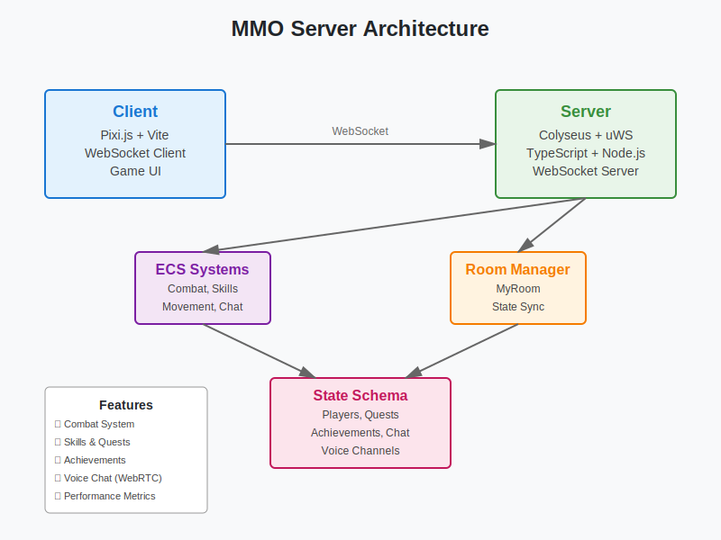

# MMO Server Documentation

Welcome to the MMO Server documentation. This directory contains organized documentation in both English and Chinese.

## Architecture Overview



**Architecture Components:**

```
┌─────────────────────────────────────────────────────────────┐
│                     MMO Server Architecture                  │
├─────────────────────────────────────────────────────────────┤
│                                                               │
│  ┌─────────────┐         ┌─────────────┐                    │
│  │   Client    │◄───────►│   Server    │                    │
│  │ (Pixi.js +  │  WebSocket│ (Colyseus + │                    │
│  │  Vite)      │         │  uWS)       │                    │
│  └─────────────┘         └──────┬──────┘                    │
│                                  │                            │
│                          ┌───────┴───────┐                   │
│                          │                │                   │
│                    ┌─────▼─────┐   ┌─────▼─────┐            │
│                    │   Rooms   │   │  Systems   │            │
│                    │ (MyRoom)  │   │  (ECS)     │            │
│                    └─────┬─────┘   └─────┬──────┘            │
│                          │                │                   │
│                    ┌─────▼────────────────▼─────┐            │
│                    │    State Management         │            │
│                    │  (Colyseus Schema)          │            │
│                    └──────────────────────────────┘           │
│                                                               │
│  Features: Combat, Skills, Quests, Achievements, Chat,       │
│            Voice (WebRTC), Leaderboard, Social                │
│                                                               │
│  Performance: Metrics, Profiling, Rate Limiting, Pooling     │
└─────────────────────────────────────────────────────────────┘
```

## Documentation Structure

```
documents/
├── README.md (this file)
├── DOCUMENT_INDEX.md      # 📋 Complete documentation index
├── DOCUMENTATION_ORGANIZATION.md  # 📊 Organization guide
├── en/                    # English Documentation (22 files)
│   ├── README.md
│   ├── FEATURES.md
│   ├── ROADMAP.md
│   ├── PERFORMANCE.md
│   ├── USAGE_EXAMPLES.md
│   ├── CLIENT_README.md
│   ├── CLIENT_FEATURES.md
│   ├── CLIENT_USAGE_EXAMPLES.md
│   ├── VOICE_INTEGRATION.md
│   ├── VOICE_CLIENT_EXAMPLE.md
│   ├── VOICE_IMPLEMENTATION_SUMMARY.md
│   ├── IMPLEMENTATION_SUMMARY.md
│   ├── CLIENT_ENHANCEMENT_SUMMARY.md
│   ├── MINIPLEX_DOCS.md
│   ├── POWERSHELL_HELP.md
│   ├── DATA_ANALYTICS.md          # *(English only)*
│   ├── MONSTER_AI.md               # *(English only)*
│   ├── OPENTELEMETRY_TRACING.md    # *(English only)*
│   ├── PROMETHEUS.md               # *(English only)*
│   ├── REDIS_SCALING.md            # *(English only)*
│   ├── SECURITY_ANTICHEAT.md       # *(English only)*
│   └── TICKET_SYSTEM.md            # *(English only)*
├── zh/                    # Chinese Documentation (15 files - 中文文档)
│   ├── README.md
│   ├── FEATURES.md
│   ├── ROADMAP.md
│   ├── PERFORMANCE.md
│   ├── USAGE_EXAMPLES.md
│   ├── CLIENT_README.md
│   ├── CLIENT_FEATURES.md
│   ├── CLIENT_USAGE_EXAMPLES.md
│   ├── VOICE_INTEGRATION.md
│   ├── VOICE_CLIENT_EXAMPLE.md
│   ├── VOICE_IMPLEMENTATION_SUMMARY.md
│   ├── IMPLEMENTATION_SUMMARY.md
│   ├── CLIENT_ENHANCEMENT_SUMMARY.md
│   ├── MINIPLEX_DOCS_CN.md
│   └── POWERSHELL_HELP.md
└── images/                # Documentation Images
```

**Translation Status**: 15/22 documents translated (68.2% complete) - 7 Chinese translations missing

## English Documentation

### Core Documentation
- **[FEATURES.md](./en/FEATURES.md)** - Complete feature documentation for all game systems
- **[ROADMAP.md](./en/ROADMAP.md)** - ⭐ MMO Maturity Roadmap: comprehensive planning for production-ready MMO
- **[PERFORMANCE.md](./en/PERFORMANCE.md)** - Performance optimization guide and profiling instructions
- **[USAGE_EXAMPLES.md](./en/USAGE_EXAMPLES.md)** - Code examples for using server features

### Client Documentation
- **[CLIENT_README.md](./en/CLIENT_README.md)** - Client overview and setup guide
- **[CLIENT_FEATURES.md](./en/CLIENT_FEATURES.md)** - Detailed client feature usage
- **[CLIENT_USAGE_EXAMPLES.md](./en/CLIENT_USAGE_EXAMPLES.md)** - Client usage examples and scenarios

### Voice Communication
- **[VOICE_INTEGRATION.md](./en/VOICE_INTEGRATION.md)** - Technical integration guide for voice communication
- **[VOICE_CLIENT_EXAMPLE.md](./en/VOICE_CLIENT_EXAMPLE.md)** - Complete client-side voice implementation examples

### Implementation Details
- **[IMPLEMENTATION_SUMMARY.md](./en/IMPLEMENTATION_SUMMARY.md)** - Summary of MMO server enhancements
- **[CLIENT_ENHANCEMENT_SUMMARY.md](./en/CLIENT_ENHANCEMENT_SUMMARY.md)** - Client feature enhancements overview
- **[VOICE_IMPLEMENTATION_SUMMARY.md](./en/VOICE_IMPLEMENTATION_SUMMARY.md)** - Voice system implementation details

### Framework & Tools
- **[MINIPLEX_DOCS.md](./en/MINIPLEX_DOCS.md)** - Miniplex ECS framework documentation
- **[POWERSHELL_HELP.md](./en/POWERSHELL_HELP.md)** - PowerShell setup help

## Chinese Documentation (中文文档)

### 核心文档
- **[FEATURES.md](./zh/FEATURES.md)** - 所有游戏系统的完整功能文档
- **[ROADMAP.md](./zh/ROADMAP.md)** - ⭐ MMO 成熟化路线图：工业级 MMO 产品完整规划
- **[PERFORMANCE.md](./zh/PERFORMANCE.md)** - 性能优化指南和性能分析说明
- **[USAGE_EXAMPLES.md](./zh/USAGE_EXAMPLES.md)** - 使用服务器功能的代码示例

### 客户端文档
- **[CLIENT_README.md](./zh/CLIENT_README.md)** - 客户端概览和设置指南
- **[CLIENT_FEATURES.md](./zh/CLIENT_FEATURES.md)** - 详细的客户端功能使用说明
- **[CLIENT_USAGE_EXAMPLES.md](./zh/CLIENT_USAGE_EXAMPLES.md)** - 客户端使用示例和场景

### 语音通讯
- **[VOICE_INTEGRATION.md](./zh/VOICE_INTEGRATION.md)** - 语音通讯技术集成指南
- **[VOICE_CLIENT_EXAMPLE.md](./zh/VOICE_CLIENT_EXAMPLE.md)** - 完整的客户端语音实现示例

### 实现细节
- **[IMPLEMENTATION_SUMMARY.md](./zh/IMPLEMENTATION_SUMMARY.md)** - MMO 服务器增强功能总结
- **[CLIENT_ENHANCEMENT_SUMMARY.md](./zh/CLIENT_ENHANCEMENT_SUMMARY.md)** - 客户端功能增强概述
- **[VOICE_IMPLEMENTATION_SUMMARY.md](./zh/VOICE_IMPLEMENTATION_SUMMARY.md)** - 语音系统实现细节

### 框架和工具
- **[MINIPLEX_DOCS_CN.md](./zh/MINIPLEX_DOCS_CN.md)** - Miniplex ECS 框架中文文档
**Translation Status**: 15/22 documents translated (68.2% complete) - 7 Chinese translations missing

## Quick Links

### For Developers
1. Start with [DOCUMENT_INDEX.md](./DOCUMENT_INDEX.md) for complete navigation
2. Check [FEATURES.md](./en/FEATURES.md) to understand available systems
3. Check [ROADMAP.md](./en/ROADMAP.md) for production-ready MMO planning
4. Refer to [USAGE_EXAMPLES.md](./en/USAGE_EXAMPLES.md) for integration examples
5. Check [PERFORMANCE.md](./en/PERFORMANCE.md) for optimization techniques

### For Chinese Developers (中文开发者)
1. 从 [DOCUMENT_INDEX.md](./DOCUMENT_INDEX.md) 开始完整导航
2. 查看 [CLIENT_README.md](./zh/CLIENT_README.md) 了解客户端
3. 查看 [ROADMAP.md](./zh/ROADMAP.md) 了解 MMO 成熟化规划
4. 参考 [CLIENT_FEATURES.md](./zh/CLIENT_FEATURES.md) 了解功能详情
5. 查看 [CLIENT_USAGE_EXAMPLES.md](./zh/CLIENT_USAGE_EXAMPLES.md) 获取使用示例

### Voice Communication Setup
1. Read [VOICE_INTEGRATION.md](./en/VOICE_INTEGRATION.md) for architecture and API
2. Use [VOICE_CLIENT_EXAMPLE.md](./en/VOICE_CLIENT_EXAMPLE.md) for implementation

## Translation Status

### ✅ Translated Documents (15/22 - 68.2%)
- CLIENT_ENHANCEMENT_SUMMARY.md
- CLIENT_FEATURES.md
- CLIENT_README.md
- CLIENT_USAGE_EXAMPLES.md
- FEATURES.md
- IMPLEMENTATION_SUMMARY.md
- MINIPLEX_DOCS_CN.md
- PERFORMANCE.md
- POWERSHELL_HELP.md
- README.md
- ROADMAP.md
- USAGE_EXAMPLES.md
- VOICE_CLIENT_EXAMPLE.md
- VOICE_IMPLEMENTATION_SUMMARY.md
- VOICE_INTEGRATION.md

### ❌ Missing Chinese Translations (7 files)
- DATA_ANALYTICS.md - 数据分析文档
- MONSTER_AI.md - 怪物AI系统文档
- OPENTELEMETRY_TRACING.md - OpenTelemetry追踪文档
- PROMETHEUS.md - Prometheus监控设置
- REDIS_SCALING.md - Redis扩展配置
- SECURITY_ANTICHEAT.md - 安全与反作弊措施
- TICKET_SYSTEM.md - 工单系统文档

### Translation Priority
1. **High**: MONSTER_AI.md, SECURITY_ANTICHEAT.md (核心游戏功能)
2. **Medium**: DATA_ANALYTICS.md, PROMETHEUS.md (运维监控)
3. **Low**: OPENTELEMETRY_TRACING.md, REDIS_SCALING.md, TICKET_SYSTEM.md (高级技术主题)

## Contributing

When adding new documentation:
- Place English documentation in `documents/en/`
- Place Chinese documentation in `documents/zh/` (when available)
- Add images to `documents/images/` and reference them in markdown
- Update `DOCUMENT_INDEX.md` with links to new documents
- Use descriptive filenames in UPPER_SNAKE_CASE.md format

### Translation Contributions
- Help translate missing Chinese documents listed above
- Follow the guidelines in `CONTRIBUTING.md`
- Use `organize-docs.ps1 -Action consistency` to check translation progress

### Organization Tools
- `DOCUMENT_INDEX.md` - Complete documentation index
- `DOCUMENTATION_ORGANIZATION.md` - Organization guide and statistics
- `organize-docs.ps1` - Automation script for maintenance tasks
